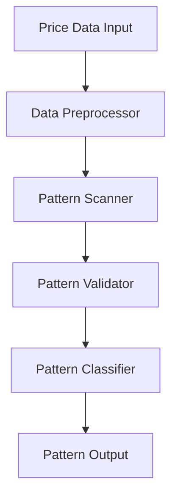
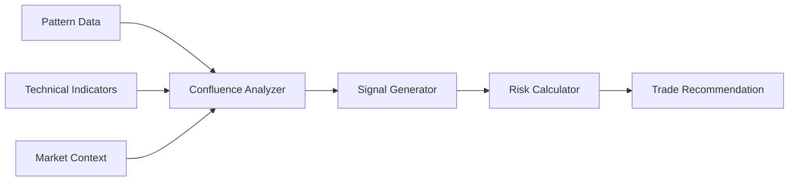

# Genius_Bryson Architecture Documentation

## System Overview

Genius_Bryson is built as a MetaTrader 5 custom indicator with advanced pattern recognition and analysis capabilities. This document outlines the architectural decisions, components, and their interactions.

## High-Level Architecture

```
Genius_Bryson/
├── Core/
│   ├── PatternRecognition/
│   ├── SignalGeneration/
│   ├── TechnicalAnalysis/
│   └── RiskManagement/
├── UI/
│   ├── Charts/
│   ├── Alerts/
│   └── Controls/
└── Utils/
    ├── DataProcessing/
    ├── Configuration/
    └── Logging/
```

## Core Components

### 1. Pattern Recognition Engine


#### Key Classes
- `PatternScanner`: Main pattern detection logic
- `PatternValidator`: Validates pattern authenticity
- `PatternClassifier`: Categorizes detected patterns

### 2. Signal Generation System


#### Components
- Confluence Analyzer
- Signal Strength Calculator
- Entry/Exit Point Calculator
- Risk/Reward Calculator

### 3. Technical Analysis Module

#### Supported Indicators
```cpp
class TechnicalIndicators {
    private:
        void CalculateFibonacci();
        void IdentifySupplyDemand();
        void DetectCandlePatterns();
        void AnalyzeVolume();
    
    public:
        double[] GetFibLevels();
        Zone[] GetSupplyDemandZones();
        Pattern[] GetCandlePatterns();
}
```

### 4. Risk Management System

#### Features
- Position Size Calculator
- Stop Loss Optimizer
- Take Profit Calculator
- Risk/Reward Analyzer

## Data Flow

### 1. Price Data Processing
```
Raw Price Data → Preprocessing → Pattern Detection → Signal Generation
```

### 2. Analysis Pipeline
```
Market Data → Technical Analysis → Pattern Recognition → Confluence Analysis → Trading Signals
```

## Technical Specifications

### 1. Performance Requirements
- Maximum processing delay: 100ms
- Memory usage: < 500MB
- CPU usage: < 20%
- Real-time pattern detection
- Instant alert generation

### 2. Scalability Considerations
- Modular design for easy updates
- Configurable pattern detection
- Extensible indicator system
- Customizable analysis parameters

## Implementation Details

### 1. Pattern Recognition Algorithms

```cpp
class PatternRecognition {
    private:
        // Pattern detection parameters
        struct PatternParams {
            int minSize;
            int maxSize;
            double confidence;
        };
        
        // Pattern validation methods
        bool ValidatePattern(Pattern p);
        double CalculateConfidence(Pattern p);
        
    public:
        Pattern[] DetectPatterns(PriceData data);
        void UpdateParameters(PatternParams params);
};
```

### 2. Signal Generation Logic

```cpp
class SignalGenerator {
    private:
        // Confluence weights
        struct ConfluenceWeights {
            double pattern;
            double technical;
            double volume;
        };
        
        // Signal calculation methods
        double CalculateSignalStrength();
        Entry CalculateEntryPoints();
        
    public:
        Signal GenerateSignal();
        void UpdateWeights(ConfluenceWeights weights);
};
```

## Security Considerations

### 1. Data Protection
- Secure storage of user preferences
- Protected trading signals
- Encrypted communication

### 2. Error Handling
- Graceful degradation
- Error logging
- Recovery mechanisms

## Testing Strategy

### 1. Unit Testing
- Pattern recognition accuracy
- Signal generation reliability
- Risk calculation precision

### 2. Integration Testing
- Component interaction
- Data flow validation
- System performance

### 3. Performance Testing
- Load testing
- Memory usage
- CPU utilization

## Deployment

### 1. Installation Process
- File structure verification
- Dependency check
- Configuration validation

### 2. Update Mechanism
- Version control
- Backward compatibility
- Configuration migration

## Monitoring and Logging

### 1. Performance Metrics
- Pattern detection speed
- Signal generation time
- Memory usage trends

### 2. Error Tracking
- Error classification
- Impact assessment
- Resolution tracking

## Future Considerations

### 1. Planned Improvements
- AI/ML integration
- Advanced pattern recognition
- Enhanced risk management

### 2. Scalability Plans
- Multi-currency support
- Custom pattern addition
- Extended timeframe analysis

## Dependencies

### 1. External Libraries
- MetaTrader 5 API
- Custom MQL5 libraries
- Technical analysis tools

### 2. Internal Components
- Pattern recognition engine
- Signal generation system
- Risk management module

## Configuration Management

### 1. System Parameters
```json
{
    "pattern_recognition": {
        "min_size": 10,
        "max_size": 100,
        "confidence_threshold": 0.75
    },
    "signal_generation": {
        "confluence_threshold": 0.8,
        "minimum_rr_ratio": 1.5
    }
}
```

### 2. User Preferences
- Visual settings
- Alert configurations
- Analysis parameters

---

This architecture document is maintained by Bryson Omullo.
Last updated: December 2024
