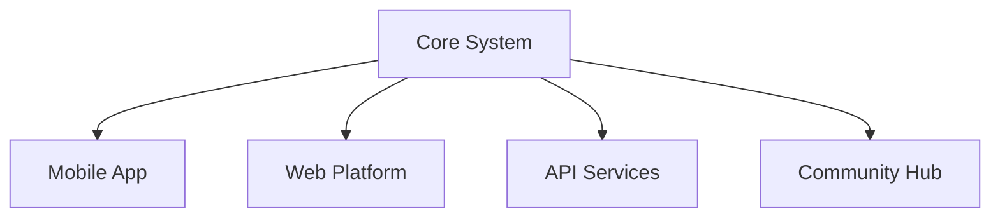

# Genius_Bryson Development Roadmap

## Vision
To create the most comprehensive and reliable automated forex chart analysis assistant, helping traders make informed decisions by reducing emotional bias and providing accurate technical analysis.

## Current Version: 1.0.0 (December 2024)

## Short-term Goals (Q1-Q2 2025)

### 1. Enhanced Pattern Recognition
- [ ] Implement machine learning for pattern detection
- [ ] Add more complex chart patterns
- [ ] Improve pattern confidence scoring
- [ ] Real-time pattern formation alerts

### 2. Advanced Signal Generation
- [ ] Multi-timeframe analysis integration
- [ ] Enhanced confluence detection
- [ ] Improved risk/reward calculations
- [ ] Custom signal rules engine

### 3. Performance Optimization
```
Priority Improvements:
- [ ] Reduce CPU usage by 30%
- [ ] Optimize memory management
- [ ] Improve pattern detection speed
- [ ] Enhanced caching system
```

## Mid-term Goals (Q3-Q4 2025)

### 1. AI Integration
- [ ] Neural network pattern recognition
- [ ] Market sentiment analysis
- [ ] Predictive analytics
- [ ] Adaptive learning system

### 2. Advanced Analytics
```
New Features:
- [ ] Pattern success rate tracking
- [ ] Market regime detection
- [ ] Volatility analysis
- [ ] Correlation studies
```

### 3. Risk Management
- [ ] Advanced position sizing calculator
- [ ] Dynamic stop loss optimization
- [ ] Portfolio risk analysis
- [ ] Drawdown protection system

## Long-term Goals (2026)

### 1. Ecosystem Expansion


### 2. Advanced Features
- [ ] Custom pattern creation tool
- [ ] Automated backtesting system
- [ ] Strategy optimization engine
- [ ] Advanced reporting system

### 3. Integration Capabilities
- [ ] Multiple broker support
- [ ] Cross-platform compatibility
- [ ] Third-party tool integration
- [ ] Custom API development

## Feature Details

### Version 1.1.0 (Q1 2025)
```
Priority Features:
1. Machine Learning Integration
   - Pattern recognition enhancement
   - Market context analysis
   - Prediction accuracy improvement

2. Performance Optimization
   - Memory usage reduction
   - Processing speed improvement
   - Real-time analysis capability

3. User Experience
   - Interface redesign
   - Custom alerts system
   - Educational content integration
```

### Version 1.2.0 (Q2 2025)
```
New Capabilities:
1. Advanced Analytics
   - Success rate tracking
   - Pattern quality scoring
   - Risk assessment tools

2. Trading Tools
   - Position calculator
   - Risk analyzer
   - Trade journal integration

3. Customization
   - User-defined patterns
   - Custom indicators
   - Alert preferences
```

## Technical Improvements

### 1. Architecture Enhancements
- [ ] Microservices architecture
- [ ] Cloud integration
- [ ] Real-time data processing
- [ ] Scalable infrastructure

### 2. Security Updates
```
Security Roadmap:
1. Enhanced encryption
2. Secure communication
3. Data protection
4. Access control
```

### 3. Performance Optimization
- [ ] Code optimization
- [ ] Resource management
- [ ] Cache implementation
- [ ] Threading improvements

## Community Features

### 1. Collaboration Tools
- [ ] Pattern sharing platform
- [ ] Strategy marketplace
- [ ] Community forums
- [ ] Educational resources

### 2. Social Integration
```
Social Features:
1. Trade sharing
2. Performance tracking
3. Community rankings
4. Strategy discussions
```

## Educational Content

### 1. Learning Resources
- [ ] Video tutorials
- [ ] Documentation
- [ ] Case studies
- [ ] Best practices

### 2. Training Materials
```
Educational Modules:
1. Pattern recognition
2. Risk management
3. Technical analysis
4. Trading psychology
```

## Quality Assurance

### 1. Testing Framework
- [ ] Automated testing suite
- [ ] Performance benchmarks
- [ ] Reliability metrics
- [ ] User feedback system

### 2. Monitoring Tools
```
Monitoring Features:
1. Performance tracking
2. Error detection
3. Usage analytics
4. System health
```

## Release Schedule

### 2025
```
Q1: Version 1.1.0
- ML integration
- Performance optimization
- UI improvements

Q2: Version 1.2.0
- Advanced analytics
- Trading tools
- Customization features

Q3: Version 1.3.0
- AI capabilities
- Risk management
- Portfolio analysis

Q4: Version 1.4.0
- Ecosystem expansion
- Mobile integration
- Community features
```

### 2026
```
Q1: Version 2.0.0
- Complete platform overhaul
- Advanced AI integration
- Cross-platform support

Q2-Q4: Continuous Improvement
- Feature enhancement
- Performance optimization
- Community development
```

## Success Metrics

### 1. Technical Metrics
```
Performance Targets:
- Pattern accuracy: 90%+
- Signal reliability: 85%+
- System uptime: 99.9%
- Response time: <100ms
```

### 2. User Metrics
```
Usage Goals:
- User satisfaction: 90%+
- Feature adoption: 80%+
- Community growth: 100%+ yearly
- Support resolution: <24h
```

## Get Involved

### How to Contribute
1. Submit feature requests
2. Report bugs
3. Provide feedback
4. Join development
5. Share experiences

### Contact Information
- Email: bnyaliti@gmail.com
- Phone: +254745959794
- GitHub: github.com/nyaliti

---

This roadmap is subject to change based on user feedback and market needs.
Last Updated: December 2024
