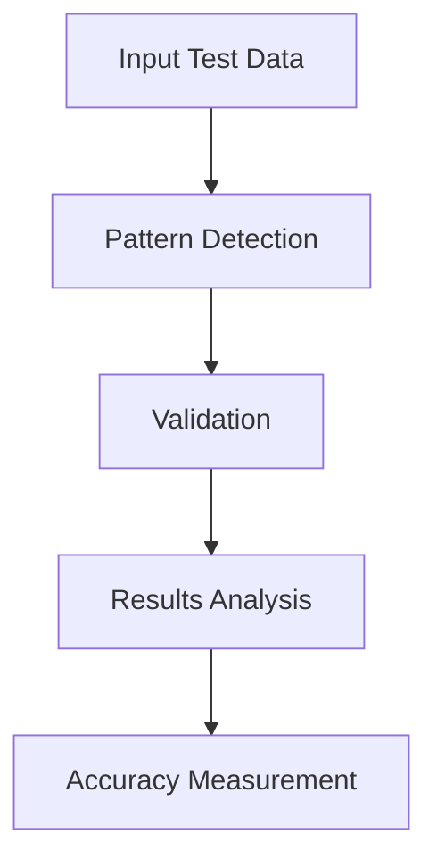

# Testing Guide for Genius_Bryson

This document outlines the testing procedures, standards, and guidelines for ensuring the quality and reliability of Genius_Bryson.

## Table of Contents
1. [Testing Environment](#testing-environment)
2. [Types of Tests](#types-of-tests)
3. [Testing Procedures](#testing-procedures)
4. [Quality Metrics](#quality-metrics)
5. [Bug Reporting](#bug-reporting)

## Testing Environment

### Required Setup
- MetaTrader 5 Platform (Latest version)
- Demo Trading Account
- Historical Data (Minimum 1 year)
- Test Data Sets
- Testing Tools Suite

### System Requirements
```
Minimum Specifications:
- Windows 8.1 or higher
- 4GB RAM
- 2GHz Processor
- Stable Internet Connection
```

## Types of Tests

### 1. Unit Tests
- Pattern Recognition Tests
  - Individual pattern detection accuracy
  - Pattern validation logic
  - Pattern classification

- Signal Generation Tests
  - Entry/Exit point calculation
  - Stop Loss/Take Profit logic
  - Risk/Reward calculations

- Technical Analysis Tests
  - Fibonacci level calculations
  - Support/Resistance detection
  - Candlestick pattern recognition

### 2. Integration Tests
```python
def test_pattern_to_signal_flow():
    # Test pattern detection to signal generation flow
    pattern = detect_pattern(test_data)
    signal = generate_signal(pattern)
    assert signal.validity == True
    assert signal.confidence >= 0.75
```

### 3. Performance Tests
- Processing Speed Tests
  - Pattern detection latency
  - Signal generation time
  - UI responsiveness

- Resource Usage Tests
  - Memory consumption
  - CPU utilization
  - Network bandwidth

### 4. Accuracy Tests
```
Test Scenarios:
1. Historical Pattern Detection
   - Success Rate Target: 85%
   - False Positive Rate: < 15%
   - Pattern Completion Rate: > 70%

2. Signal Generation Accuracy
   - Win Rate Target: > 60%
   - Risk/Reward Accuracy: > 90%
   - Entry/Exit Precision: ±5 pips
```

## Testing Procedures

### 1. Pattern Recognition Testing


#### Test Cases
1. Basic Patterns
   - Flag patterns
   - Channel patterns
   - Triangle patterns

2. Complex Patterns
   - Head and Shoulders
   - Double/Triple tops/bottoms
   - Cup and Handle

### 2. Signal Generation Testing
```
Test Matrix:
| Pattern Type | Market Condition | Expected Signal |
|--------------|------------------|-----------------|
| Bull Flag    | Uptrend         | Strong Buy      |
| Bear Flag    | Downtrend       | Strong Sell     |
| Consolidation| Sideways        | Neutral         |
```

### 3. Risk Management Testing
- Position Size Calculations
- Stop Loss Placement
- Take Profit Levels
- Risk/Reward Ratios

## Quality Metrics

### 1. Pattern Recognition Quality
```
Metrics:
- Detection Accuracy: > 85%
- False Positive Rate: < 15%
- Processing Time: < 100ms
- Pattern Completion Rate: > 70%
```

### 2. Signal Quality
```
Requirements:
- Signal Accuracy: > 60%
- Risk/Reward Precision: > 90%
- Entry/Exit Accuracy: ±5 pips
- Confluence Level: > 75%
```

### 3. Performance Metrics
- CPU Usage: < 20%
- Memory Usage: < 500MB
- Response Time: < 200ms
- Data Processing: < 100ms

## Bug Reporting

### Bug Report Template
```markdown
## Bug Description
[Detailed description of the issue]

## Steps to Reproduce
1. [Step 1]
2. [Step 2]
3. [Step 3]

## Expected Behavior
[What should happen]

## Actual Behavior
[What actually happens]

## Environment
- MT5 Version:
- Windows Version:
- Indicator Version:

## Additional Information
[Screenshots, logs, etc.]
```

### Priority Levels
1. Critical
   - System crash
   - Incorrect trading signals
   - Data corruption

2. High
   - Pattern detection errors
   - Signal generation delays
   - UI malfunction

3. Medium
   - Visual glitches
   - Minor calculation errors
   - Performance issues

4. Low
   - Cosmetic issues
   - Documentation errors
   - Feature requests

## Automated Testing

### 1. Test Automation Framework
```python
class AutomatedTesting:
    def setup_test_environment(self):
        # Setup code
        pass

    def run_pattern_tests(self):
        # Pattern recognition tests
        pass

    def run_signal_tests(self):
        # Signal generation tests
        pass

    def generate_report(self):
        # Report generation
        pass
```

### 2. Continuous Integration
- Automated test runs
- Performance monitoring
- Code quality checks
- Build verification

## Test Data Management

### 1. Historical Data Sets
- Multiple timeframes
- Various market conditions
- Different currency pairs
- Known pattern examples

### 2. Test Scenarios
- Trending markets
- Ranging markets
- Volatile conditions
- News events

## Regression Testing

### 1. Regression Test Suite
- Core functionality tests
- Pattern recognition tests
- Signal generation tests
- Performance benchmarks

### 2. Update Testing
- Version compatibility
- Configuration migration
- Data integrity
- Feature compatibility

## Documentation

### 1. Test Documentation
- Test plans
- Test cases
- Test results
- Performance reports

### 2. Maintenance
- Regular updates
- Version control
- Change tracking
- Result archiving

## Contact Information

For testing-related queries:
- Email: bnyaliti@gmail.com
- Phone: +254745959794

---

Last Updated: December 2024
Version: 1.0.0
